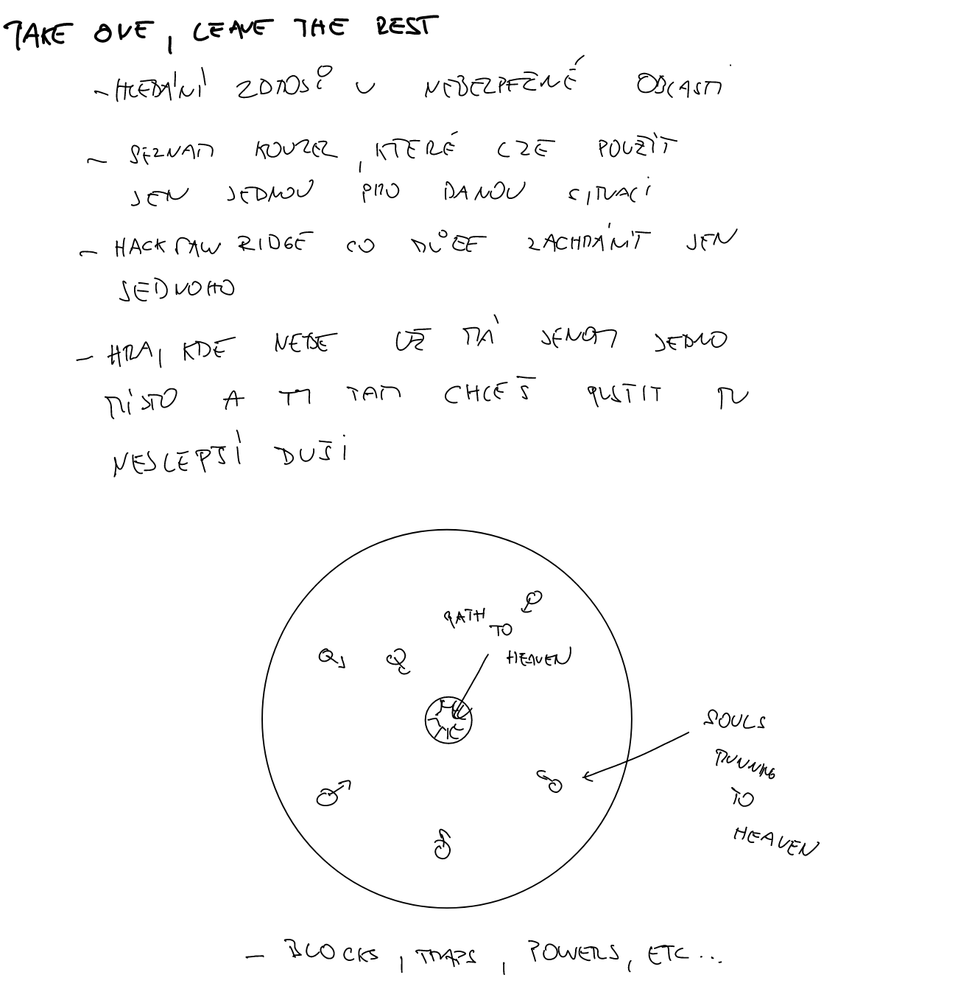
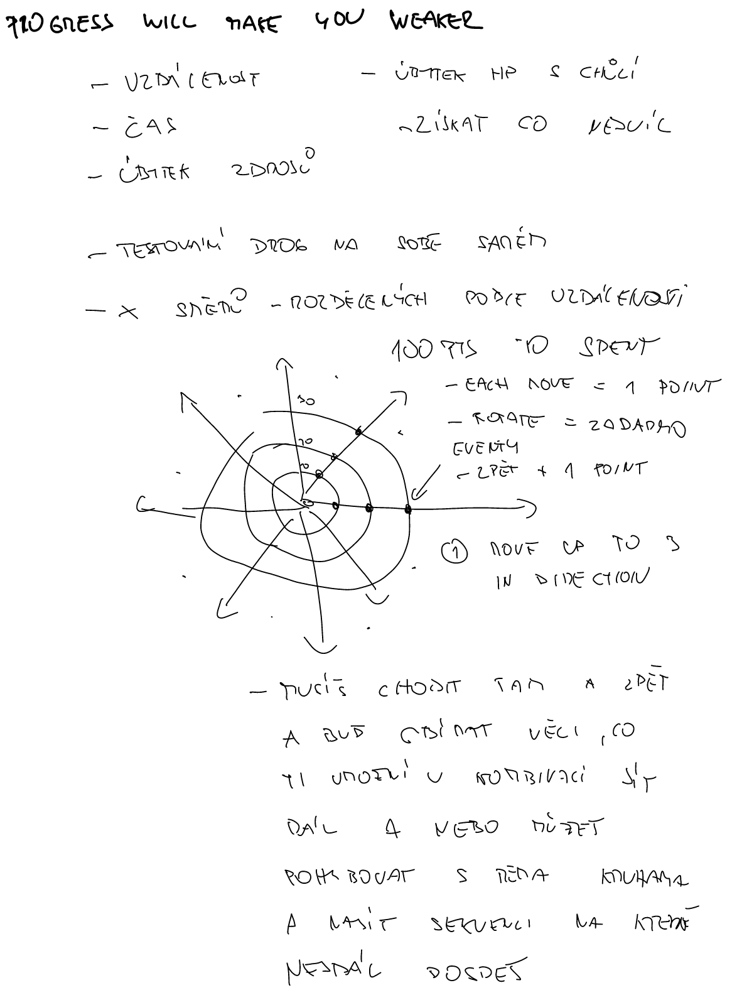
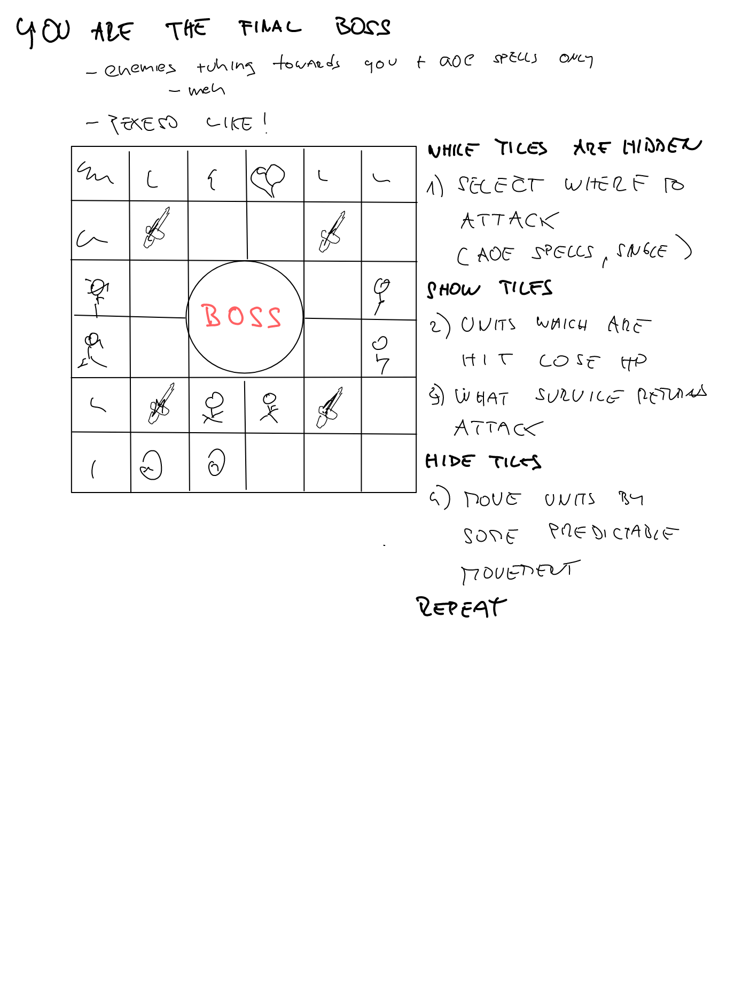
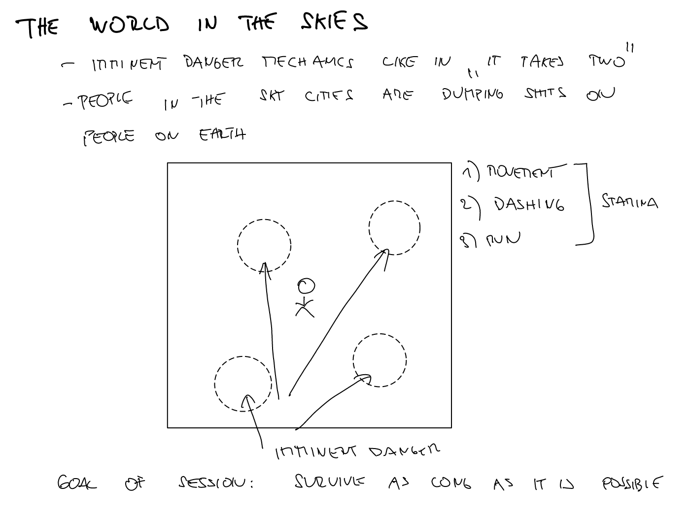

I signed up for a [course](https://skvt.cz/course/122-game-design-pro-zacatecniky "course") and as a way to prepare, 
I have challenged myself to come up with an idea each day starting from May 9th until June 9th. 

I will focus on the "base layer," as stated in the book "The Pyramid of Game Design" by Nicholas Lovell, because I believe it creates the core of a game. I think Keith Burgun, who wrote "Game Design Theory," shares this view because his book suggests that a game is something that is infinitely repeatable and can last forever which is how I understand the "base layer". 

I will continuously update this blog as time goes on. :)

## Table of Contents

```toc
# This code block gets replaced with the TOC
```

### Take one, leave the rest

This idea is somehow based on the first game I tried by myself in Unity. It is about heaven being almost at its capacity when it is only 
able to take one last soul into heaven. But the souls keep coming to the heaven stairs, so you have to keep them away until the right soul reaches the stairs.



### Progress will make you weaker

During this theme, I figured out that I am able to dream about something, but as it is with dreams, I am not able to give it a proper shape. This is something that has always hindered me during game jams.

To combat this, I will try to come up with a sort of template that I can use to guide me during this challenge.

Anyway, I was thinking about a game where you have 100 points to move. If you move forward by your own will, you will lose a point. If you move backward, you will gain a point, and moving left to right will not cost you any points.

There would be 8 possible directions to choose from by moving left or right, and each direction presents different choices that can either hinder your progress or push you forward faster. Sometimes, there could be locked doors that require a key to open. To acquire the key, you would need to go backwards and try different directions. Once you have the key, you would need to go backwards again to reach the locked door. Or something like that!



### You are the final boss

Oh my, the theme generator reminds me of the themes from the Ludum Dare game jam. 

Anyway, I believe this idea came to my mind because we were playing "Sleeping Gods" by Ryan Laukat. There was a fighting system in the game that took place on a 4x4 grid. Some tiles on the grid represented the health of the monster, some represented its additional attack, and so on.

The game I came up with also happens on the grid, not sure how big the grid would be, but it can vary probably based on the difficulty of the game. The game is repeating in cycle of 4 steps:

**While tiles are hidden**
1. Select where to attack (mostly AOE spells)

**Show tiles**

2. Units which are hit by selected attacks from first step receive dmg
3. What survived returns damage to the boss (therefore you)

**Hide tiles**

4. Move units by some predictable movement, so player can anticipated where the units will be

**Repeat**

I can already envision a pre-event screen where the player chooses which attacks they would like to use in the next session, as well as a post-event screen where they can use the points they have acquired to buy or upgrade spells.



### World in the skies

When I was playing "It takes two" with my all knowing partner, I found the most amusing part to be the fight against the toolbox boss. 
The fight involved a lot of nails falling from the sky, and the game displayed the area of impact with a shadow. If the player was standing in the shadow for too long, they would get hit by the nail.

Inspired by this boss fight, I thought about creating a simple game, but instead of nails, there would be trash coming from a city in the skies.

Goal of the session would be to survive as long as possible. You could also collect the trash and build something which would help you in another rounds. :)



### Everything falls apart

I still did not come up with the template to help me come up quickly with the idea for a base layer of the game. Mostly because I did not even try, but
I am not sure if it is even possible.

Lets think, what the games above have in common? Apart of the world representation (grid, free movement circle) I think there isnt much of what they have in common.

