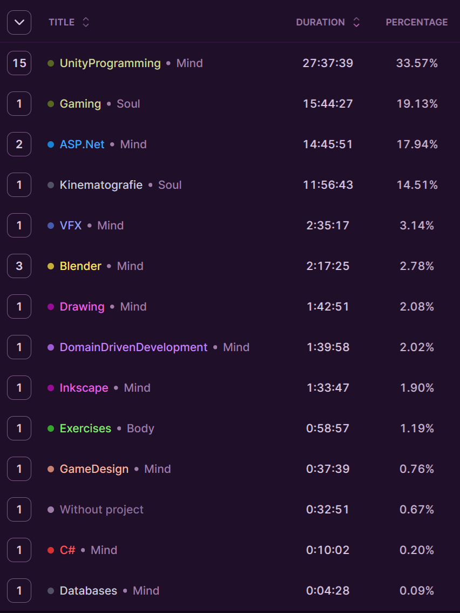

> "Uprdelismus" 

## Table of Contents

```toc
# This code block gets replaced with the TOC
```

### Focus of the month

So, april is month when ludum dare is happening, so I believe that the april should be just about that. Games. :)

### Reflection

April was quite beautiful! Finish the LudumDare made me incredibely happy which again proved to me that game development is a right thing for me. Another thing beautiful on april was the lack of the goals. I was not stressed about anything and just enjoyed what I liked. It of course has a drawbacks - I did not push myself to learn anything new properly, so I can say that my knowledge portfolio is more or less same as it was at the end of the March. Which is quite shame, but I think that one month of relaxing is allowed.

I am aware these articles are shorter and shorter. I realized that I am not able to adhere to the "focus of the month" no matter how I try, so starting with May I am going to remove this section. The goal is going to be simple from now on:

* learn something to work
* learn something for my joy
* do something for game development
* train
* read one book

And get those 3 hours per day of learning god damn it!





