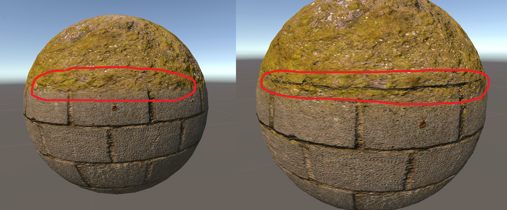
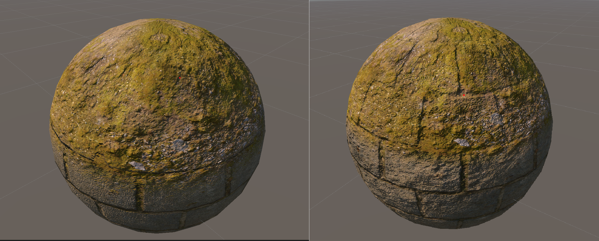

> "I did not get a chance" – a sentence from "Million Dollar Baby" that sparked a profound emotion within me. It prompted a realization that every day, I'm presented with an opportunity to engage in something I genuinely desire. It would truly be a regrettable circumstance to pass away without discovering whether my passion holds true, or if I possess the capability to transform it into reality.

This is going to be the first series I'll be writing on a regular basis. Each post will correspond to a specific month, capturing what I've been focusing on and more. Recognizing the importance of having a routine to achieve my goals, I'll be tracking the time spent on various topics. Additionally, I'll be planning and preparing blog content in advance, outlining my monthly focus to stay on track.


## Table of Contents

```toc
# This code block gets replaced with the TOC
```

### Focus of the month

August is going to revolve around the theme of art. During this month, I plan to delve into various aspects of art, including learning Blender, honing my drawing skills, and exploring shaders. Additionally, I will dedicate some time to GatsbyJS to improve my blogging capabilities. These are the four skills I would like to explore, which go hand in hand with the idea that I am able to dedicate at least 4 hours a day to learning. You know, considering 8 hours of sleep, 8 hours of work (which can feel like quite a waste, right :)), and 8 hours of free time, of which I intend to spend half with my fiancée. We'll see if this plan is achievable.

### Reflection

This being my first reflection, it might come across as a bit rushed. But I'm confident I'll make my way there, somehow, sometime.

In the 'Focus of the Month' section, I articulated my intention to dedicate 4 hours each day to learning. Initially, I presumed this would be a straightforward goal to achieve. However, reality proved otherwise, as it turned out to be more challenging than anticipated. My average daily learning time currently stands at: __.

This led me to introspect and ponder, 'Is it feasible for fatigue from sleep or work to impede my ability to carve out the necessary time for propelling myself toward the finish line?' Seeking resolution, I took a day of leave from my conventional 9-to-5 occupation, only to discover that I managed to engage in learning for a mere 3 hours and 36 minutes.

It was this nagging feeling that I should create something, and it kept distracting me. I was thinking about a concept for a space racer, a platformer, and in the end, I was revisiting one of my older ideas. Thinking about game designs always costs me a great deal of energy; nonetheless, it is always fun.
  
Because it is so distracting, I decided that the last week of the month is going to be focused on 'The Case of the Boring Game,' as I called it. The idea is to finish a simple game in a week while using the knowledge I acquired during the month. Why 'The Case of a Boring Game'? Well, many of my ideas end with 'that's too boring to finish,' and I never finish anything this way.

Despite all the distractions, it proved to be a significant month, owed to the invaluable principle of '50/50' that I integrated while embarking on the course-driven journey, drawing inspiration from [draw a box](https://www.drawabox.com "drawabox"). This principle advocates a balance of 50% focused study intertwined with 50% hands-on practice. This approach prevented me from merely consuming plain tutorials, often referred to as 'spoonfeeding.' Instead, it urged me to engage actively and endeavor on my own. This method not only aids in understanding the concepts profoundly but also solidifies new knowledge by melding it through the crucible of practical application.

Now, I am going to briefly describe what I have been doing during the month.

#### Blender

As for the Blender I focused on courses from Grant Abbit. Truly, this extraordinary individual stands as the finest mentor I've encountered in my pursuit of mastering Blender. His unique teaching style, filled with a challenges that beckon us to deep our understanding, evokes memories of the great Jonathan Weinberger, whose courses opened the gateway to my world of game development.

I started with [course]](https://www.gamedev.tv/courses/1672425 "gamedev tv blender course") I aquired in the GMKT game jam. To be honest I tried to learn the Blender in past few times, so I was familiar with few of the tools, but not that much, so I think it is safe to say that if you just start you are in the same position as I was.

I had completed around 24% of the course, and I was somewhere in the texturing module, which came after the module where I learned to build a roof, when I realized that I did not want to start learning how to do texturing. Instead, I would rather continue focusing on creating basic stuff to have a firm grasp of the tools before moving on to other tools in Blender. This thinking led me to separate the basics into following categories:

> * modeling
> * scupulting
> * texturing
> * topology
> * rigging

So, during those 24%, I focused on learning everything connected to the usage of tools for modeling, such as extrusion, beveling, inserting faces, rotation, scaling, moving, loop cuts, and more. 

 

To practice a bit more of modeling I stopped the course above and started looking for some good source for practice. I found out that my favorite tutor has exactly the [course](https://www.youtube.com/watch?v=98FkRIbihyQ&list=PLn3ukorJv4vvv3ZpWJYvV5Tmvo7ISO-NN&ab_channel=GrantAbbitt "daily practise") I need. But do not get mistaken that it is only about practise, there is a lot more to learn than I would think. Most scary of all, the new knowledge is called 'topology,' which is something I had a hard time wrapping my head around. But don't be afraid and trust Grant. I was able to grasp topology as I progressed through the videos.

While I was thinking about the platformer game mentioned in the part where I was writing about distractions, I needed a low-poly character. I wanted to ensure that I would begin with a solid foundation of understanding how to create one, so I looked up a [course](https://www.youtube.com/watch?v=4OUYOKGl7x0&ab_channel=GrantAbbitt "low poly character course") from Grant. I encountered a hurdle in animating it using [mixamo](https://mixamo.com/). To achieve animation, it seems I'll need to acquaint myself with a Blender plugin for Mixamo. I suspect this will form the focal point for my endeavors in September. Yet, the final decision remains pending.


#### ShaderGraphs

Right from the start, I dove into Gabriel Aguiar [playlist](https://www.youtube.com/playlist?list=PLpPd_BKEUoYjcFaqriaMchx5gOqBs2tDh), eager to roll up my sleeves and get into the thick of it. However, it did not explain shaders very well; instead, it focused on their usage in combination with the VFX graph. It wouldn't do any good for my self-esteem, as I need to understand what I am doing to feel confident about it. Fortunately, after searching the internet, I stumbled upon [courses](https://www.youtube.com/watch?v=OX_6_bKpP9g&list=PL78XDi0TS4lEBWa2Hpzg2SRC5njCcKydl&pp=iAQB "course") from Ben Cloward. He helped me establish a solid foundation to approach shader graphs with confidence.

My curiosity was piqued by the concept of creating moss, especially after stumbling upon an alluring image featuring moss-covered hexagons. This endeavor was not solely motivated by aesthetics but also served as a valuable learning experience as we worked with diffuse, normal, and roughness textures - knowledge I can apply when importing textures created in Blender.

* [Moss](https://youtu.be/Q43XBychCEY)
  * can be combined with with [view, world, object & tangent](https://youtu.be/E6Srr-HaicI) which will allow you to honor the shape of the object given by normals
  * the moss course also introduced blending normal maps, which is done lerping the textures, but there is an [another approach](https://youtu.be/GKVBJ7aO1Mk) to it
  * there were two more videos on how to improve normal maps, but they required having textures prepared in a specific manner. I chose to skip it as I did not want to spend time by preparing the textures for it.





As a testament to my skills, I attempted to apply moss to the cube. However, the same method only worked on one side (the top), which wasn't the desired outcome. I realized I needed a gradient from bottom to the top of the cube. Nevertheless, I was uncertain about the approach until I came across the [lenght & distance](https://youtu.be/wTHKzjYBH7U) tutorial, which demonstrated how to move the pivot of the UVs which did the trick.

While I was attempting to merge this knowledge with insights from [view, world, object & tangent](https://youtu.be/E6Srr-HaicI) to properly honor the shape bestowed by normals on the object, a realization dawned that I lacked clarity about the behavior of vectors during their transformation from tangent space to another space. And let me tell you, it took an unexpected turn from there. I scoured the internet, embarking on a journey that carried me from elementary tutorials to the comprehensive courses on [math planet](https://www.mathplanet.com/) and the captivating streams by [Freya Holmér](https://www.youtube.com/@Acegikmo). Both captivated my attention. It seems the time has come to tread the path of "To learn MATH" on my journey. 


### Handy links

* [This](https://polyhaven.com/) is a great link for downloading PBR materials or models
* [Solution](https://forum.unity.com/threads/main-preview-in-shader-graph-is-blank.1412793/ "solution") to problem with previewing shaders in the shader graph for opaque materials
* [Official manual for unity shader graphs](https://docs.unity3d.com/Packages/com.unity.shadergraph@5.6/manual/Getting-Started.html "shader graphs manual")