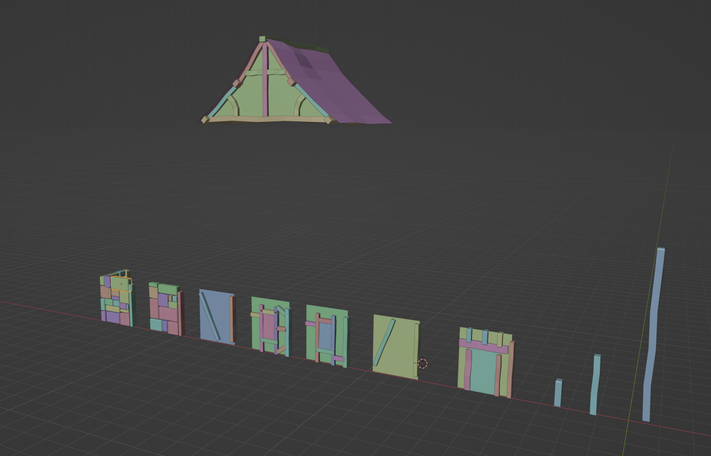

## Table of Contents

```toc
# This code block gets replaced with the TOC
```

### Courses from Grant Abbit

Truly, this extraordinary individual stands as the finest mentor I've encountered in my pursuit of mastering Blender. His unique teaching style, filled with a challenges that beckon us to deep our understanding, evokes memories of the great Jonathan Weinberger, whose courses opened the gateway to my world of game development.

#### Blender Environment Artist: Create 3D Game Worlds

[This](https://www.gamedev.tv/courses/1672425 "gamedev tv blender course") is the course which I aquired in the GMKT game jam. To be honest I tried to learn the Blender in past few times, so I was familiar with few of the tools, but not that much, so I think it is safe to say that if you just start you are in the same position as I was.

I had completed around 24% of the course, and I was somewhere in the texturing module, which came after the module where I learned to build a roof, when I realized that I did not want to start learning how to do texturing. Instead, I would rather continue focusing on creating basic stuff to have a firm grasp of the tools before moving on to other tools in Blender. This thinking led me to separate the basics into three categories:

> * modeling
> * scupulting
> * texturing

So, during those 24%, I focused on learning everything connected to the usage of tools for modeling, such as extrusion, beveling, inserting faces, rotation, scaling, moving, loop cuts, and more.

 


#### GetGood

To practice a bit more of modeling I was looking for some good source to do so and found out that my favorite tutor has exactly the [course](https://www.youtube.com/watch?v=98FkRIbihyQ&list=PLn3ukorJv4vvv3ZpWJYvV5Tmvo7ISO-NN&ab_channel=GrantAbbitt "daily practise") I need.

### Low-poly character

I was on the hunt for something I could do to adhere to the 50/50 rule, therefore I decided to create an astronaut for the game brewing in my mind. To get me on the right track I used [course](https://www.youtube.com/watch?v=4OUYOKGl7x0&ab_channel=GrantAbbitt "low poly character course"). However, after setting up the background and examining the final model, I believe the course was no longer necessary (this is my perspective after reaching GetGood Level 6).