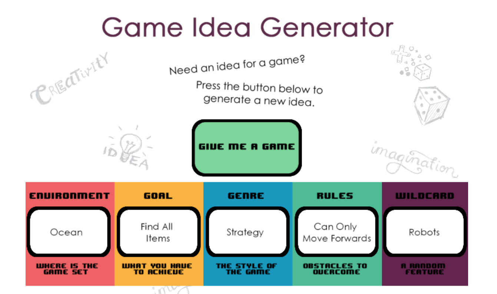

> I am going to rather build something boring than nothing at all. 

This is going to be the first instance of a 'boring game' which I mentioned in the August 2023 report. It will serve as a platform to apply the knowledge gained during the first three weeks of the month and as a strategy to prevent myself from getting sidetracked by thoughts of other games during the learning period. Inspired by a random video on YouTube, I utilized a [generator](https://ygd.bafta.org/resources/game-idea-generator) to spark an idea for a game. Needless to say, this game must be developed within 72 hours.



## Table of Contents

```toc
# This code block gets replaced with the TOC
```

### Learning-Focused Game Development Project Timeline

I requested ChatGPT to compose a develop timeline for me. Even the headline.

#### Day 1 - Sailboat Model and Basic Mechanics:
- **Sailboat Model in Blender** *(2 hours)*: Create a basic sailboat model in Blender for use in Unity.
- **Sailboat Movement** *(3 hours)*: Implement the sailboat movement mechanic in Unity, focusing on the core functionality.

#### Day 2 - Resource Gathering and Model Creation:
- **Island Layout and Resources** *(2 hours)*: Design a simple layout of a few islands. Plan resource types and placements.
- **Resource Models in Blender** *(2 hours)*: Create models for the resources (e.g., wood, stone) in Blender.

#### Day 3 - Boss Battle Mechanics and Model Creation:
- **Boss Battle Scenario Design** *(2 hours)*: Plan the basic boss battle scenario, including attack patterns and positioning.
- **Boss Battle Mechanics** *(3 hours)*: Implement the boss battle mechanics in Unity, incorporating strategic positioning.
- **Boss Character Model in Blender** *(2 hours)*: Create a basic model for the boss character in Blender.

#### Day 4 - Polishing, Shaders, and Documentation:
- **Polishing and Playtesting** *(2 hours)*: Playtest the game loop, refine mechanics, and address any major bugs.
- **Shader Exploration in Blender** *(2 hours)*: Experiment with creating basic shaders in Blender for sailboat and environment elements.
- **Polishing and Bug Fixing** *(2 hours)*: Further polish the gameplay experience and address remaining bugs.
- **Documentation** *(2 hours)*: Write a brief document outlining the game mechanics, controls, and shader techniques for future reference.


### Reflection

According to the proposed timeline it should take 24 hours to finish the game. I will now share a breakdown of my work sessions with its duration.

#### Session 0 - 00:50

Well, the first hour of my timeline was spent to..., create a sailboat in Blender! It was fun, nowhere near completion, but I believed it would be a good idea to test how quickly I can create something to experiment with in Unity.

#### Session 1 - 1:18 (2:08 in total)

The second hour was spent painting the boat a little bit. Since this was my first time, it took me longer than anticipated, but I am happy with the outcome. I am actually pleased that ChatGPT began with the sailboat model, as the subsequent models are designed following their respective logic and I love to work on a game when it already looks like a game. 

Nonetheless, I am still aligned with the timeline, but I think it's time to move on to implementing the sailboat movement. 

#### Session 2 - 2:14 (4:22 in total)

I would say that the basic movement is done, but I am going to use the rest of the time tweak it a bit.

#### Session 3 - 0:35 (4:57 in total)

Well, the control works, but I am not that happy with the camera. I would like to create something what will follow the ship in a little bit of cinematic way. Meaning, when it will go forward, I am going to just follow it, but when it will go to the side ways I would like to rotate and look on the ship from the side view. Hopefully I will manage it somehow. Anyway, it means, that I will have a bit of delay. I guess like two hours maybe?