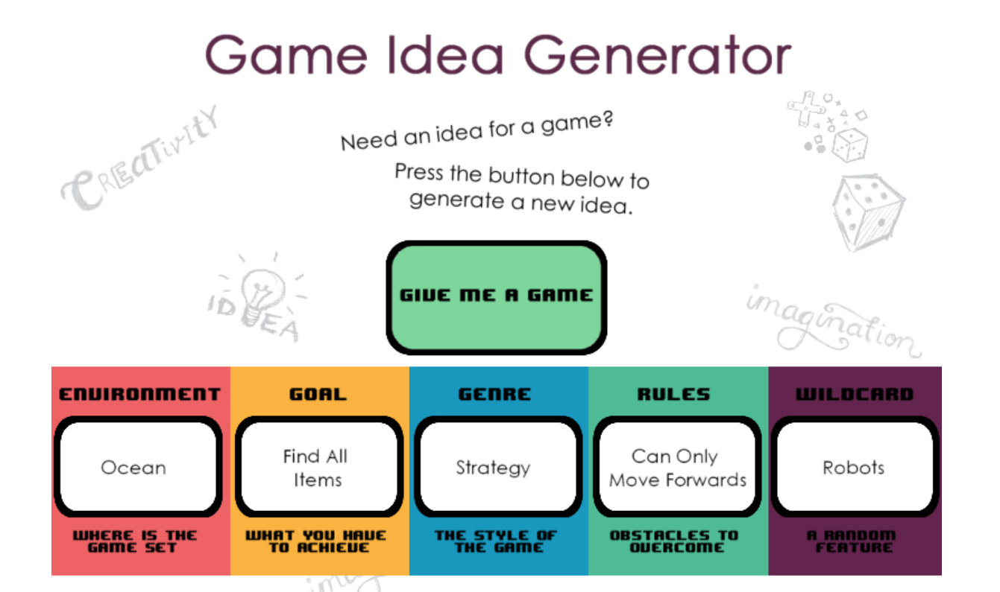
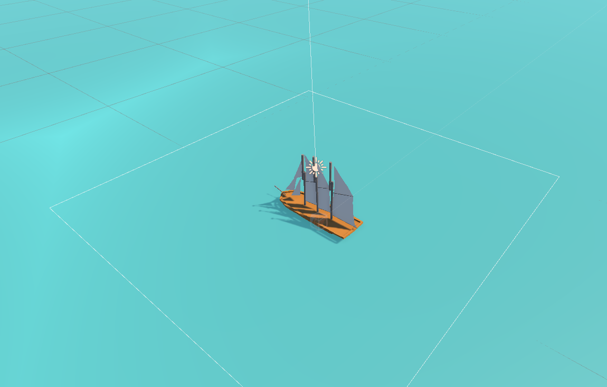
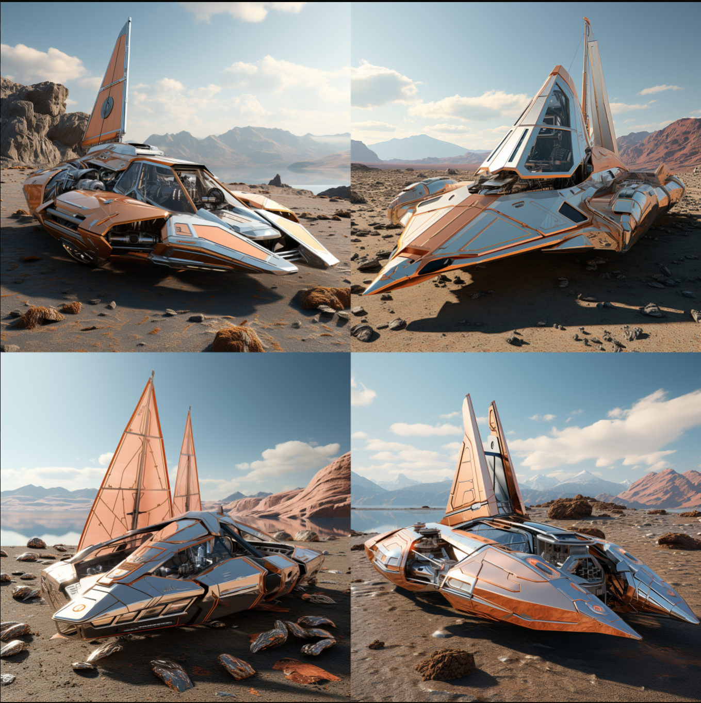
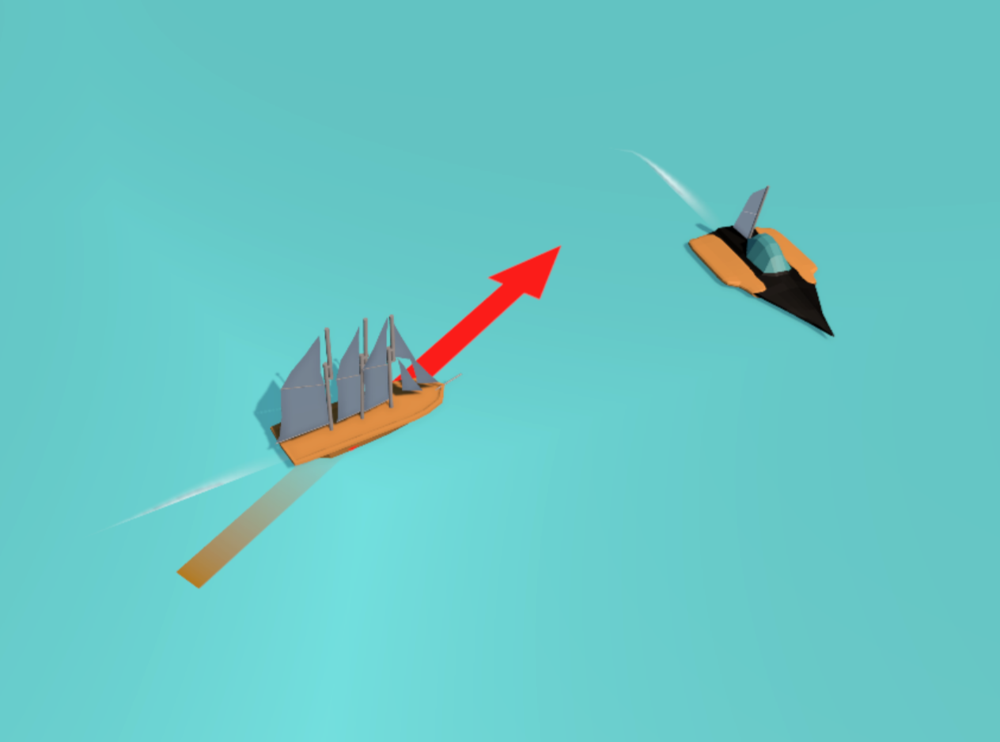

> I am going to rather build something boring than nothing at all. 

This is going to be the first instance of a 'boring game' which I mentioned in the August 2023 report. It will serve as a platform to apply the knowledge gained during the first three weeks of the month and as a strategy to prevent myself from getting sidetracked by thoughts of other games during the learning period. Inspired by a random video on YouTube, I utilized a [generator](https://ygd.bafta.org/resources/game-idea-generator) to spark an idea for a game. Needless to say, this game must be developed within 72 hours.



## Table of Contents

```toc
# This code block gets replaced with the TOC
```

### Learning-Focused Game Development Project Timeline

I requested ChatGPT to compose a develop timeline for me. Even the headline. I don't think it is a good timeline as there are missing things like the polishing phase, something to handle inventory, and so on, but we will see.

#### Day 1 - Basic Models and Core Mechanics

1. **Basic 3D Modeling (3 hours):**
   - Create a simple 3D model of the sailboat using Blender.

2. **Vector-based Navigation (4 hours):**
   - Develop the vector control system for sailboat movement.

#### Day 2 - Resource Mechanics and Gameplay Systems

3. **Basic 3D Modeling (3 hours):**
   - Design a simple 3D model for the resource.

4. **Resource Collection (4 hours):**
   - Implement resource spawning, floating behavior, and automatic collection upon contact.

5. **Basic 3D Modeling (3 hours):**
   - Create a basic 3D model for the island structure.

6. **Island Upgrades (3 hours):**
   - Develop mechanics for island upgrades and spending collected resources.

#### Day 3 - Environmental Dangers, Enemy Interactions, and Polish

7. **Basic 3D Modeling (2 hours):**
   - Model a simple 3D enemy boat using Blender.

8. **Environmental Dangers (4 hours):**
   - Design tornados that periodically appear in the game world.
   - Implement tornado movement patterns and collision detection.

9. **Tornado Defense Mechanic (3 hours):**
   - Create a defense mechanism for players to prevent tornados from hitting the island.

#### Day 4 - Polish, Visual Enhancements, and Finalization

10. **Enemy Interactions (4 hours):**
    - Design basic enemy boat AI movement towards the island.
    - Program the enemy boat's firing behavior and collision detection.

11. **Advanced 3D Modeling (3 hours):**
    - Create detailed 3D models for island structures, enemy boats, and additional assets.

12. **Game Loop and Progression (2 hours):**
    - Set up a game loop with alternating waves of enemy attacks, resource collection, and tornado events.
    - Define progression logic to increase wave difficulty.

13. **Visual Enhancements (3 hours):**
    - Import advanced 3D models into the game engine.
    - Implement visual effects for various interactions and events.

14. **Sound Effects (2 hours):**
    - Add simple sound effects for different actions and events in the game.

**Total Estimated Development Hours:** 42 hours


### Reflection

According to the proposed timeline it should take 42 hours to finish the game. I will now share a breakdown of my work sessions with its duration. [Here](https://github.com/Snory/BoringGame1) you can find a code for the game.

#### Day 1 - 00:50

So the first day was going according to the plan. I created a simple sailboat in Blender and prepared basic movement. Although it was a headache to prepare the movement as I had not been programming for a while, I eventually got it done. I think that the camera could use some more work, but I guess it is something I am going to do in the polish phase.


#### Day 2 - 4:07 (4:47)

On the second day, I was playing in Blender with texturing. I had a hard time export textures to Unity for some reason, so it is not used yet, and I will return to it in the future. I also improved the movement, added an indicator of direction and force you are about to apply to the ship, and created a green island where you should trade with someone. However, I scratched that idea for now.



#### Day 3 - 2:41 (7:35)

I found myself grappling with a common feeling that crops up during game development - the fear that the end result might turn out uninteresting. The lack of a captivating game loop and other concerns occupied my thoughts. Pushing through this challenge is tough, especially when my vision for the game isn't crystal clear, or if it is, it doesn't resonate as fun in my mind.

However, I'm approaching this hurdle similarly to how developers tackle the 'pass the challenge game.' I'm implementing features and seeing where they lead. Along these lines, I introduced a concept - a wrecked boat. By skillfully navigating near the wreck, it triggers the spawning of planks. These planks could serve as a resource, potentially aiding in healing. Time will reveal their true potential.

#### Day 4 - 4:22 (11:57)

Yesterday evening, before I went to sleep, I came up with an idea for the game and how to make it more fun. It started with an idea of collection messages in a bottle, but ended up with robots. There are going to be a robots boat with a predictable movement pattern. They are a rogue robots that went into the Bermuda Triangle. They are trying to find a way by repeating the pattern it followed when it got lost. It is dangerous to move around the robot ships, as they attack you when you get too close. The only way to shut them down is to hit them to certain spot without triggering their action if you're within their range. This means you have to observe the pattern and find the right time to sail the ship in the direction to hit the correct spot. Once you're in their range, you cant control the direction, otherwise they would kill you right away.

The idea was pretty straightforward and should have been implemented quickly, but being true to my nature, I made it a bit more challenging. I came across a video discussing async methods in Unity. They don't necessarily replace existing methods; instead, they provide an additional tool in the toolbox. They can return values, and the chaining of operations is more streamlined using the 'await' keyword. However, they also come with their fair share of downsides. I encountered a few of these downsides while attempting to make it work.

But I managed to prepare it somehow. It is a little bit hard to put the pattern in place as I am only drawing the directions to gizmos, but hey, it works. I am going to prepare something enhanced later.

As you can see I am not align with the proposed timeline from chatgpt as it was generating the timeline for different game. Anyway, I am going to leave it her as reminder to myself that the plans change and they change a lot.

#### Day 5 - 1:37 (13:34)

I purchased a subscription for Midjourney to gain an idea of what the robot ship could look like. I spent the rest of the time attempting to recreate one of the pictures from Midjourney. I was uncertain about how to achieve a viewpoint from the top, bottom, and sides, but then I did not even bother to search for solutions. 



Tomorrow, I will program the hitboxes for the robots so I can deactivate them. The next step will involve a bit of level design to gain insight into what is and isn't feasible within the mechanics I've developed.


#### Day 6 - 2:21 (15:55)

I finished the robot ship and programmed the hitboxes, but even though I believe in the mechanics, the enemy ship doesn't adhere to them. This means that I need something for the model where I can use different spots for hitboxes while it should make sense to hit them by looking at the model. 



