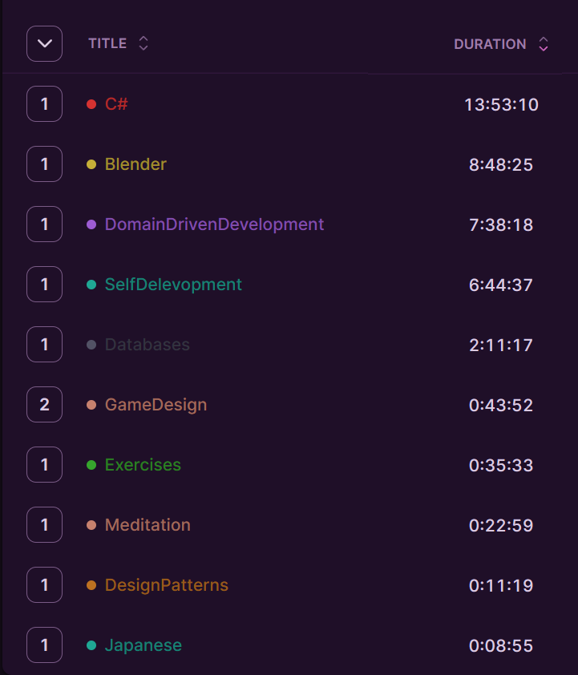

> "Eh?" 

## Table of Contents

```toc
# This code block gets replaced with the TOC
```

### Focus of the month


As January was a month full of work-related tasks, I'm aiming to shift my focus to my hobbies in February. However, amidst the challenges, there's always something positive to be found. Reading technical books in January was unexpectedly enjoyable, and I've decided to continue this habit. This month, I plan to read:

- C# in depth
- Grooking algorithms
- Enterprise patterns

Additionally, I want to dedicate some time to learning about design patterns, starting with the creational ones.

With Ludum Dare approaching, I need to sharpen my skills in Blender. Specifically, I aim to efficiently create simple characters with animations and import them into Unity. My goal is to spend about one hour per character.

### Reflection

#### Time spent

In total, I spent 41 hours working on my knowledge portfolio and well-being. Last year, I was aiming for three hours per day, which is still a significant amount of time. Despite only achieving 1.4 hours per day, I feel like I learned a lot.

My plan to dive deep into C# took up almost 34% of my time, and while it was a considerable investment, I don't regret it. Learning C# has boosted my confidence at work and will also benefit my game jam hobby, so that's a positive outcome.

Blender, which I had hoped to dedicate more time to, ended up taking about 22% of my time. While I've made progress in creating character models, I've realized that I need to simplify my process to be more efficient for game jams.

Learning about Domain-Driven Development accounted for 18.5% of my time. This was crucial as I'm working on a new microservice at work and needed to prepare myself for the challenge. Understanding DDD has helped me navigate the implementation used in our company and make it less confusing for others.

The remainder of my time was devoted to self-development and well-being, including activities like reading a book about pragmatic thinking or meditation. While these activities may seem unrelated to my goals, they contribute to my overall growth and mindset.

Overall, February was a month focused on work-related tasks instead of hobbies as I hoped for, but I still managed to make progress in my personal and hobby-related pursuits.




