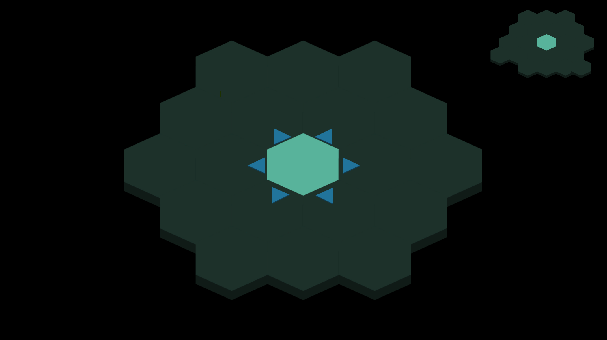
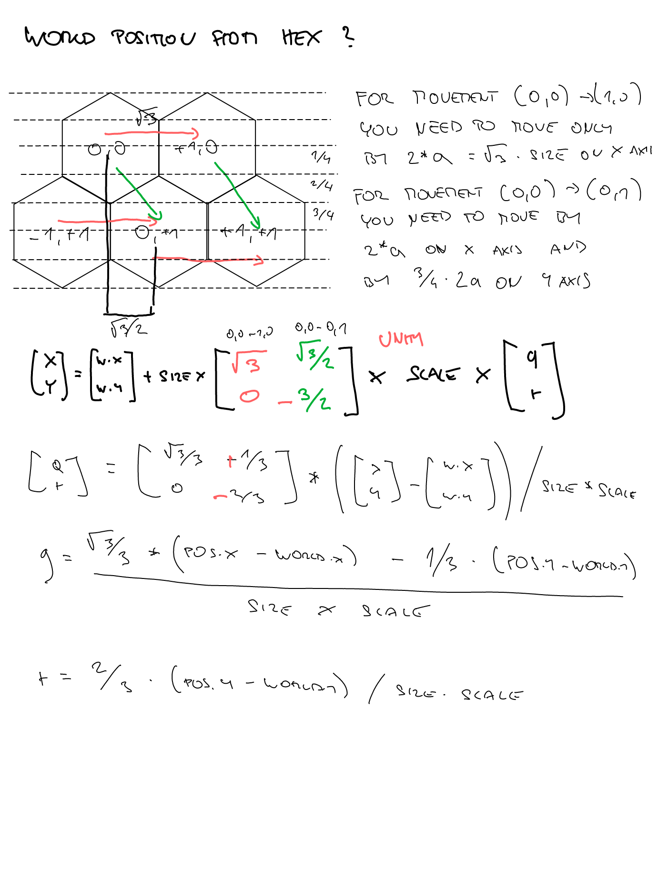
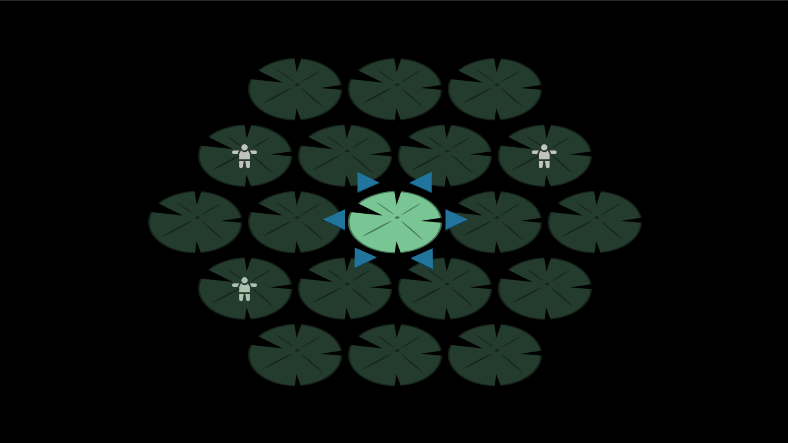

I've signed up for a week-long [gamejam](https://itch.io/jam/gamedevtv-jam-2023? "gamejam") called GameDevTV Jam 2023 because they're offering a free course on their site just for participating and submitting a game!

Now, I'm not saying I'm addicted to tutorials or anything like that. I believe I've moved past that stage. But they have courses on Blender and drawing, which could be interesting additions to my skill set. I mean, who knows? Besides, the theme of the game jam is "Life in 2 dimensions," which perfectly aligns with an [idea](https://robinontheway.com/30DayGDChallenge/#one-room "idea") from  my personal challenge I've been obsessing over lately. I just need to make a few adjustments, like switching from day night cycle to dimensions with lights and no lights, and voilà!

I should note that my available time for working on the game will be limited due to other commitments. Over the weekend, I'll be away in nature, and during the work week, I'll only have mornings to dedicate to the game development. This leaves me with approximately 15 hours to complete the game, which far less then I have ever tried, but we will see. :)

As usual, I will continuously update this blog as time goes on. :)


## Table of Contents

```toc
# This code block gets replaced with the TOC
```

### Timeline

I will now share a breakdown of my work sessions with its duration.

#### Session 0 - 2:30 (2:30 in total)

I spent around two and a half hours playing around with designs in Inkscape and then some time in Unity creating the light rays. There were numerous approaches I could have taken, but ultimately I decided to use particle effects. This choice not only achieved the desired effect of light rays but also added a dynamic element to the scene, giving it a nice touch of liveliness. Next goal is to create a character with 6-directional movement. I've found some inspiration on the internet that I'll use as a reference for the movement ratios. 


#### Session 1 - 2:30 (5 in total)

Seems like my attention span is only two hours and thirty minutes, good to know. Anyway, the original plan was to create a character with 6-directional movement. However, I realized that without knowing the "story behind" or the concept, I wasn't sure what to draw. Rather than spending too much time pondering over it, I decided to eat the frog first. So, I jumped right into generating the hex grid. I must say, [this](https://www.redblobgames.com/grids/hexagons/ "this") article was a godsend and provided valuable guidance. I decided to use pointy top with axial coordinates as it will allow me to simply identify neighbors.


At first, I was contemplating generating just the grid in memory since it wasn't necessary for players to see it in order to play the game. However, I was curious about how to generate a visible hex grid, so I went ahead and implemented it anyway. 


I also made the decision to change the particle effects for the light because I have a slightly different vision for it. However, in order to achieve that, I will need to learn more about particle effects.

#### Session 2 - 1:00 (6 in total)

During the day, I contemplated the capacity of players to remember and associate sounds with positions. While ChatGPT might suggest the idea of a "ducktilion" (which seems highly unlikely), I do not think so.A hexgrid of range 2 would need to accommodate 19 distinct sounds, which is already a considerable number.

While I was out shopping, an idea struck me. Instead of assigning a unique sound to each hex in the game, what if I only assigned sounds to the hexes surrounding the player within a range of two? As the player moves, the range would also move. Whenever an object within the range is interacted with, the corresponding tone would play. If an object within the range subsequently moves, the tone would be played again. This approach would require the player to remember only 19 tones and provide an opportunity for them to improve their skills over time. I also pondered the idea of integrating a handy minimap into the game. This nifty feature would give players a quick glimpse of their current position within the hexgrid, ensuring they always have their bearings. Moreover, the thought of empowering players to customize the assigned tones themselves crossed my mind. This would allow for a personal touch, letting players choose tones that resonate with their preferences and enhance their overall gameplay experience.



#### Session 3 - 3:00 (9 in total)

I initially struggled with deciding how to move the hex grid in my game. I couldn't come up with a clear solution at first. Should the player be responsible for movement while the camera follows them, or should the grid itself handle the movement? Eventually, I settled on the idea of moving the grid itself. I am going to implement a system where each node on the grid has an assigned "occupant." When the grid moves, it triggers a method on each node to adjust its world position. If a node has an occupant, their position will also be aligned with the new world position of the node. I considered placing the occupant under the node in the hierarchy, but I then the child would also be scaled which is not something I want.


After this initial struggle, I noticed that the movement was opposite along the Y-axis. It took me almost an hour and a half to realize that the problem lied in the Unity axis system, where Y is positive towards the top, while my algorithm assumed Y to be negative at the top. I considered correcting the algorithm to align with the Unity axis system, but instead, I decided to adjust the direction of movement to avoid messing with the algorithm itself.

So, halfway through the allotted time, it feels like I haven't accomplished much at all. Next step is going to be show range of the "dimension hearing" after player is moved. 

#### Session 4 - 0:30 (9:30 in total)

I adjusted the algorithm for converting world positions to hexgrid positions to align it with Unity's Y-axis, where positive values point upward. This change helped prevent unnecessary headaches and improved the smoothness of navigation.



The grid movement is now functional. In my next session, I plan to implement keyboard controls and work on the promised highlights for the current range of "dimension hearing". Additionally, I'm considering propagating the current neighboring nodes to the layer, allowing the "arrows" indicating possible directions to be toggled on/off when there are no available places to step on. 

#### Session 5 - 1:30 (11:00 in total)

I have successfully implemented the mechanism for highlighting nodes. However, I encountered an issue with the sorting order of the hex tiles during the process. The sprite, being in "3D", appears as stairs instead of a flat surface when not aligned properly. I will need to address this problem and ensure the tiles are correctly positioned for a seamless visual experience. 

Boy, with only four days remaining until the end of the game jam, I have to start waking up at 3 am to put in some serious work.

#### Session 6 - 1:00 (12:00 in total)

Here comes the hero! While walking in nature with my all-knowing partner, we came across lily pads in the river. Suddenly, an idea struck me: "What if the hex tiles in the game are represented as lily pads and the main character is a frog?" And so, the story unfolds—a frog emerges from the pond, existing on the edge of two dimensions.

Where there is a hero, there is hope.

 

And indeed, when you step on a lily pad, it can now produce a "delightful" sound, and the highlight functionality is working as well. Next session, I plan to focus on creating some enemies for the game.

#### Session 7 - 1:00 (13:00 in total)

As promised, I have added monsters to the mix. They are now capable of generating themselves on the "pond" and make their presence known by playing a "dimensional tone" assigned to the lily pad. The next step is to program the interaction between the player and the enemies. When the player moves and an enemy is within the highlighted range, the enemy should notify the player of its presence. This should be relatively straightforward since I have already assigned audio clips to highlighted lily pads. I just need to ensure that the "MonsterMover," as I call it, is aware of the player's movement. This will trigger the movement of the monsters and result in the corresponding audio clip being played.

 

#### The story

I asked the chatgpt to write me a story about the game and here it is:

Once upon a time, in a hidden cave deep within the heart of a mystical forest, there existed a unique pond. This pond was unlike any other, for it sat on the edge between two realms—the realm of light and the realm of darkness. Within this pond resided a solitary frog, whose duty was to guard the delicate balance between the two realms.

The frog, known as Kermit, was not an ordinary amphibian. He possessed the ability to illuminate the pond whenever he touched a lily pad. However, only the lily pad he touched would shine, casting a soft glow in the otherwise pitch-black cave. The lilypads, connected to another dimension by their roots, each emitted a distinct tone when someone stepped on them in the alternate realm.

Kermit's responsibility was to ensure that no one from the alternate dimension crossed over into his realm through the enchanted pond. He knew that they were aware of his presence and would try to eliminate him before attempting to cross over. Determined to fulfill his duty, Kermit remained ever vigilant, perched on a large lilypad at the center of the pond.

#### Session 8 - 1:00 (14:00 in total)

I dedicated my efforts to implementing enemy movement. It's amusing how many times I have to remind myself of how the A* pathfinding algorithm works. But as it works with the "space force," I just watched the movie "Hidden Figures" today, and there was a moment when Catherine was trying to figure out how to bring the space shuttle from orbit to Earth. She had an idea, but in order to execute it, she had to run and find a book with the theory about it and calculate. Well, I bet she knew how to use it in the past but simply forgot because she does not use it very often. :)

Anyway, the algorithm for finding the shortest path is complete. It may not be the most optimal, but since I don't plan to have large grids, it should suffice. In the next session, I'll focus on managing the state of the game. I have an idea to implement a session state system where, after the player moves, the state changes to "EnemyMovement." Once all the enemies have moved, the state will switch back to "PlayerMovement." Changing the state will trigger an event that will be received by interested entities, such as the player and enemies. In the "EnemyMovement" state, the enemies will search for their paths, and in the "PlayerMovement" state, the player's movement controls will be unlocked.

#### Session 9 - 1:00 ( 15:00 in total)

The game session state manager is in place. It is a little bit wobbly, but it serves its purpose. During development, I thought about the retention layer. You need to transmit and store certain information between sessions, such as high scores, enemies killed, and objectives completed. I think my next quest after this game jam will be to create something for the boilerplate template that helps me store this kind of information between sessions. Next session is going to be about finishing the enemy movement.

#### Session 10 - 1:00 ( 16:00 in total)

I had to add something called "EntitiesPrepared" to the GameSessionStateManager. It helps me determine if everything is ready to start the game, as I had trouble synchronizing all the events. As usual, a bit of frustration led to an unnecessary bug that cost me a significant amount of time. But hey, it now works flawlessly. So, next session, for sure, is going to be about finishing the enemy movement.

#### Session 11 - 3:00 ( 19:00 in total)

The enemy movement turned out to be a bigger headache than I had hoped for. Firstly, the world coordinates were calculated after the enemy movement, causing them to move off the grid. To fix this, I added another game session state called "GridCalculation." This state comes right after the player's movement, as it affects the grid.

The next issue was with assigning occupancy to the nodes (lilypads). I forgot to remove the occupancy when moving the enemy, resulting in lag in their movement. While it wouldn't affect gameplay significantly, I wanted to address it for smoother gameplay.

In short, since I'm using a lot of events to avoid singletons and direct references, it feels like it's backfiring. It's possible that I'm using them incorrectly, but dealing with event communication took me around 2 to 3 hours already.

The next step is to complete the game loop, which involves adding the ability for the player to eliminate the flies (enemies, yet to be determined what they will be) and, of course, the possibility for the player to be eliminated when they step onto his lilypad.

#### Session 12 - 1:00 ( 20:00 in total)

I had to test the idea of using sound as an indicator of the monster's location. To do this, I created 18 different sounds (originally intended to be 19, but I excluded playing anything when the player is on the same lilypad). I also added a setting to the code to accommodate this feature. So next session I can finally move to the closing the game loop.

#### Session 13 - 1:00 ( 21:00 in total)

Now, you can defeat those... I'm still unsure about their identity, darn it, but you can kill them if they are close enough. 

#### Session 14 - 0:15 ( 21:15 in total)

And now they can kill you.

#### Session 15 - 0:15 ( 21:30 in total)

Player can try the sound of lilypads by right clickng on them.


#### Session 16 - 0:30 ( 22:00 in total)

I had to rework how the nodes functioned. Initially, I didn't want them to directly implement Monobehavior so I could spawn them without that baggage. However, I realized the need to provide feedback to the player when they perform an action. The best solution I could think of was to implement a shaking effect on the lilypad to give the player visual feedback.

#### Session 17 - 1:15 ( 23:15 in total)

I probably am not in the mood to develop today. Firstly, I had to deal with a bug that was disabling player movement right after it was turned on. It turned out to be the problem with event communication again. The order to turn it off from the previous round came after the second round had started. If I am going to make a turn-based game, I will have to find a better way to handle it. Another issue is that I am not able to... Oh, I just realized what is wrong. Well, maybe I can address it in the next session.

#### Session 18 - 4:00 - 6:00 ( 27:15 - 29:15 in total)

We had a free Sunday, so I dedicated as much time as possible to work on the game. Finally, I was able to test the game idea after 29 hours. I believe that's quite a long time for such a simple concept. I would have expected to have a working prototype within around 10 hours. Perhaps I should focus more on finding shortcuts and not worry too much about the expandability or reusability of the components. The main goal should be to get the core idea working quickly to ensure it's at least enjoyable. I believe that's the essence of game jams - receiving feedback on a game prototype. It should answer the question "Is this something what people would be interested in?"

Anyway, the core loop is closed. You can finish the session, the game, lose, and receive a score. But damn, it's just a prototype, no art, no visual effects. How on earth do people in game jams manage to finish such amazing games? I don't believe they program for longer than I did for this game. In fact, in Ludum Dare, I believe I am reaching the limit of time I can spend on it.

#### Session 19 - 2:00 ( 29:15 - 31:15 in total)

I added "ring power" to the mix, fixed some bugs, played a few rounds, and attempted to create a frog character for the game. However, I encountered difficulties and ended up using a head for the tutorial icon instead. The feedback for the idea will determine the next steps. If it is well-received, I may consider creating a 3D version, although Keith Burgun suggests that 3D should only be utilized if it adds additional mechanics or benefits. But we can argue that the benefit would be my exploration of 3D mechanics and the learning experience it provides.

And yes, I am going to download the frog and lilypads from the internet, somewhere.

And finally, [Here](https://snory.itch.io/melody-pond "Here") it is.

 

#### Feedbacks

I have received feedback on how to improve the game. Since I am not currently working on it, I will leave a note here.

Firstly, it would be a good idea to display the number of monsters you have heard, and also play the sound of their movement without any delay. This means that the game would not be delayed when monsters that did not play a tone move.

Additionally, it is suggested to introduce a boost called "long tongue" which would allow you to kill monsters from a greater distance.

Lastly, it is recommended to have a different sound for the sonar than the one used for the lilypads.


