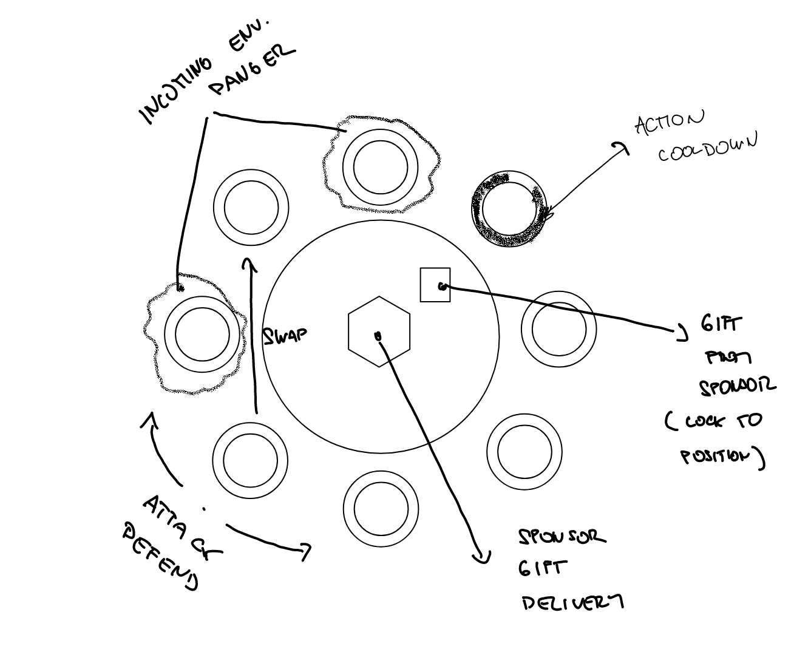
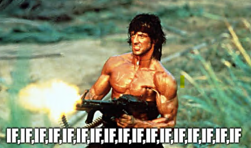

## Basic idea

The Ludumdare starts at 3 am. In the past, I would have said that it's a normal hour for me since I used to wake up early to ease my transition into the IT world. However, that's not the case anymore. I aim to sleep until 5 or 6 am nowadays, but my old habits sometimes kick in and I end up waking up earlier. This was the case when the Ludumdare began at 3 am, and I found myself eagerly awaiting the theme. As soon as "Delivery" was announced, an idea struck me almost instantly - something that had never happened in previous game jams. It was partly due to the fact that I came up with the basic idea while I had been working on a game concept that I hope to one day play at a LAN party I attend annually.

The idea behind this game was to create a challenging experience where players must switch positions around a circle with other competitors while avoiding environmental hazards and enemy attacks, all while trying to collect as many sponsor gifts as possible.

## First day

At the beginning of the first day, everything went quite well. Since I had managed to come up with a simple game idea this time and had also prepared a boilerplate for the game jam, the basic game was created quite fast. But then it started. First of all, Unity, for some reason, started "Reloading script assemblies" for almost 45 seconds after I edited some lines in Visual Studio, and then another 45 seconds when I pressed play. This really irritated me, so I went to Google to search for a solution. It cost me a great deal of time, but at the end of the day, I downloaded Unity 2022, and it fixed the issue.

## Second day

During the second day, I spent a lot of time playing the game. Thing that bugged me was how to present all the information to the player. I always struggle with UI design, so it was a challenge for me. However, by the end of the day, I had come up with a plausible way to present the information (option a) and finally went to sleep.

 

## Third day

Third day consited of three things:

* trying to get LootLocker working for a leaderboard
* fixing bugs
* IFStein

As for the leaderboard, it was already part of my boilerplate, so I just had to refresh my memory on how it works. However, this task still took me a few hours. I wanted to make sure it was working correctly, especially since I was worried it might not work on WebGL. Thankfully, it worked fine, at least until the final version.

Bugs, oh bugs. I noticed that many of the bugs were caused by my decision to use a spaghetti code style and cram everything into a few classes. Despite the extra effort required to fix the bugs, I believe the end result was worth it in terms of simplified code and improved speed of prototyping which I think is important in Ludumdare.

Here are the most important classes:

**Unit**

As the name suggests, this class represents the playable unit in the game. It can perform actions such as attacking, defending, taking damage, moving, or cooling down.

**Seat**

A seat at the table, this class doesn't have much logic beyond checking its state, such as "Is it under attack?" or "Is it being moved into?" Most of the code was added to support AI later on.

**Table**
  
This class does pretty much everything. It's called "Table" because in the original idea, the game was about knights and magicians sitting around a table. The class generates units, seats, and sponsors, and also receives requests to attack, defend, or switch with a seat.

And before the sun went down, I was working on the AI using an approach we use at work to program for e-commerce businesses, which involves a bunch of conditional statements (IFs).

