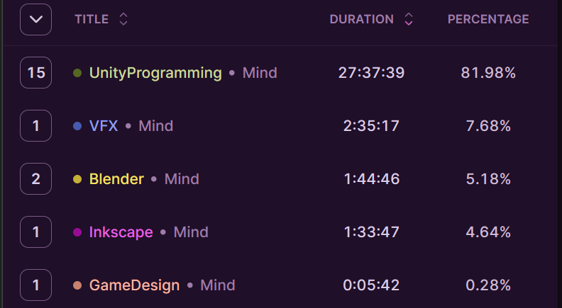

## Table of Contents

```toc
# This code block gets replaced with the TOC
```

## The jam 

In the past, I tried to describe each day, but I just couldn't remember how each day went, so this time I'll attempt some form of summary.

I had a full three days to work on LudumDare, and of course, I was measuring everything, as you can see below. What was difficult to measure was the time spent on design (under the category GameDesign) and testing (under the category Gaming) because I was designing and playtesting constantly, or at least that's how I remember it. Anyway, in total, I spent around 33 hours on LudumDare, which is quite nice!



What I aimed to align myself with was implementing the core mechanic within an hour or so. This ensured that I wouldn't spend the entire day working on something that could end up as a disaster. This approach led me to discard two ideas. It wasn't that I couldn't implement them in an hour, but rather, after doing so, they were simply boring. The third idea worked out better, and I felt it had potential, so I expanded on it.

Looking back, the game is so simple that I could probably program it within a day now. So where did all the time go? Well, I guess it went into playtesting and game design.

For example, initially, it was just about matching colors with acolytes. But then I started thinking about how to determine when the player loses. I had to spawn the correct amount of acolytes in random order, and give them some room to make a mistake, or cover my back if the algorithm failed. And now, this aspect seems simple.

Despite the challenges, I managed to finish the game, which is nice. You can play it here: Sacrifice Acolyte.

And the lesson learned? Really try to spend only one hour at most on the core mechanic, and if you have the core mechanic, build everything else around that.