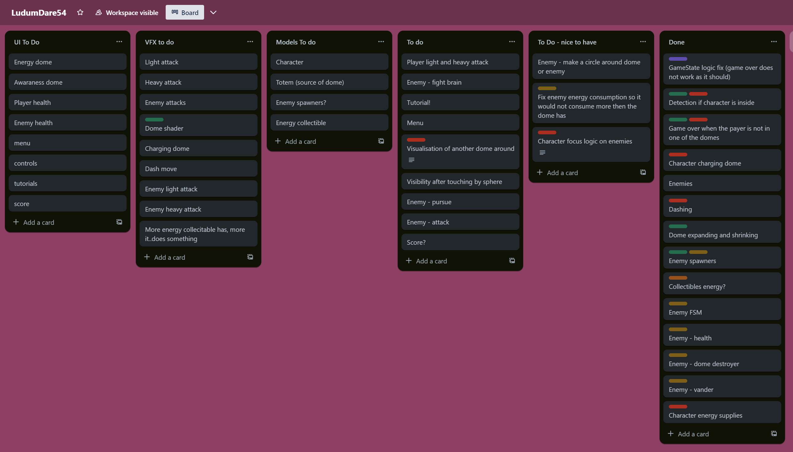
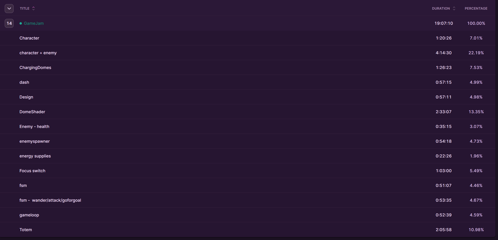
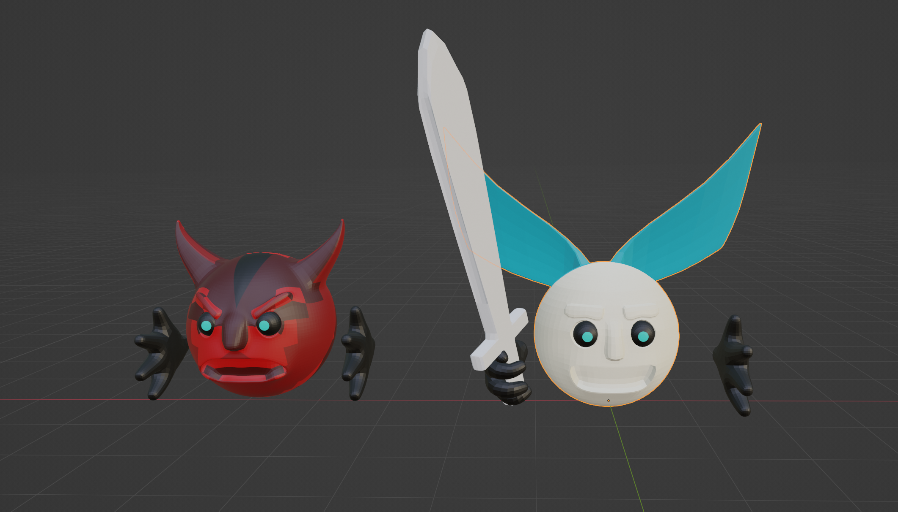

One of my favorite game jams because it is the first one I participated in, and it also has a great community, thanks to the blog posts directly on the site. I can only recommend this one for beginners!

For the first blog post about game jams, I tried to write about what I was doing each day, but it was hard to remember at the end of the day. For the second blog post about game jams, I tried to write about what I was doing each session, but it resulted in a huge table of contents. This time, I'm going to try to combine both approaches.

## Table of Contents

```toc
# This code block gets replaced with the TOC
```

### Preparation before the jams

Back in the day, the only thing I had prepared for Ludum Dare was my boilerplate, which you can find here: ["BoilerPlate"](https://github.com/Snory/GameJamBoilerplate) (which I really need to fix one day as there is always something broken). But this time, I was better prepared. I decided to improve my skills in Blender, as I'm looking to transition to 3D game development. Additionally, I spent time watching various YouTubers participating in game jams and pass-the-game challenges.

Watching these YouTubers was particularly enlightening because it made me realize that most of them have a preferred genre in which they feel comfortable, and they adapt the theme to fit that genre. So, I began to ponder what genre I would enjoy working on to the extent that I could dedicate my time solely to it. After careful consideration and a nostalgic trip back to my childhood, I settled on arena fighters.

You might have heard about the Unity debacle with the installation fee. While it initially left me somewhat paralyzed for a few days, I later realized that I don't yet have a game idea that I wholeheartedly believe will lead to success. Therefore, switching to a different game engine doesn't make sense at this point. However, this situation did highlight that relying too heavily on engine-specific tools can make my skills somewhat fragile. As a result, I've made a decision that if there's something I can accomplish by myself in a reasonable amount of time, I won't use engine-specific tools.

For example, I recently downloaded Naruto Shippuden: Ultimate Ninja Storm 4 and decided to implement the same camera system as in the game. While I could have used Cinemachine, I opted to understand the process of creating the camera myself, as it will be more valuable in the long term.

### The jam (19:13:09)

So, the jam took up almost an entire day, and I wasn't able to finish (more on that later). Before I dive into what I was doing each day, or rather, how I felt each day, I'd like to jot down a few notes to myself about what went well and what I should definitely continue.

First of all, for the for the first time I was using Trello and it sure is a good way how to stay on track. I did not have a time to think about organization, but I am going to come up with something for the next game jam.



Secondly, measuring with Toggl is also a good way to stay on track. It helped me realize that I was going down the rabbit hole with some topics. In combination with Trello, I always had an idea of how much time I could invest in something. Although it can be quite stressful, no one is forcing you to participate, so you are your own enemy in this.



Which brings me to the third point. I don't know why, but I always get quite stressed before and during LudumDare. It's as if my life depends on it. There was a moment when I told myself, 'Oh, come on, you're doing this because you like to explore, so explore.' And it helped; it helped me shake the stress off my shoulders, and I managed to program quite a chunk of code after that (before the stress hit me again). So, next time, I'm going to write some kind of mantra.


#### First day (9:48:25)

At the beginning of the first day, I was full of optimism. The theme that won the theme slaughter was "Limited space." Well, if there is a game that suits limited space, it is definitely a fighting arena. But, of course, it wouldn't be me if I wasn't thinking about something more than just a fighting arena.

I decided to add "totems" that would generate a protective barrier for you. The goal was to increase the barrier enough so it would cover another totem which you could expand. You would do this until you reach the end. The energy for the barrier was coming from the monsters that were trying to destroy it. If you killed them, they would drop the energy needed to increase the barrier. The same energy was about to be used for dashing, light, and heavy attacks. So, it was a nice matter of handling resources to expand and attack. Also, while you were expanding, the monsters would not spawn. Since you needed the energy to expand the barrier from them, you had to balance it to get enough energy to increase the barrier to the next totem.

But I was struggling pretty hard during the coding. Each feature, even the simple one like "dashing," cost me one hour of my time. That is a lot. A feature like dashing should be done in a matter of 15 minutes, at least that's what I believe. Then I spent another hour of my time playing with the fighting arena camera (about which I am going to write some articles, as the tutorials are nowhere to be found, and I believe it is going to be useful).

Even though there was a struggle, I managed to create a solid foundation to finish the game, but... then the second day came.

#### Second day (9:18:42)

The second day was all about the look, and it crushed me. Firstly, I was not able to come up with a solution for the barrier. I needed a transparent shader that would render back and front so that even though I am inside, I can see the barrier. After an hour, I had an idea of how to achieve it, but I planned to postpone the VFX to either later that day or the next day, as I knew I am going to spend a lot of time with Blender (thanks to my drilling before, I knew that 2 hours per model is minimal for me).

And it was a brutal fight. Firstly, it took me two hours to create a stupid totem. It was just a bunch of cubes, but that devastated my self-confidence. If there was some remaining hope I am going to finish it, it was killed by the character. I tried to create a humanoid character, but I was just not able to do so. It looked like a hooker next to the street, really.

So quite pissed, I created a new simple spherical character, and ..., I was actually happy about it! It was fast to create, easy to modify. Next time, I am for sure going to aim for something like that instead of a fully-fledged character.  Anyway, the animations were the last straw. I'm sure I was doing something wrong, but I found myself rewriting animations that were already done, struggling to restore poses, and wrestling with origins. It was a real ordeal.



These are going to be the first key takeaways:

* Create a simple shape.
* Color it with a palette (that's a neat trick).
* Rig the basics.
* Animate the basics.
* Back it up.
* Only then add details, hard surfacing, and so on.

Oh boy, if I had followed the key takeaway right from the start, it would have saved me a lot of time. 

### What next

I made a decision that even though I was not able to deliver the game for the compo or jam, I am going to submit it as an extra entry this time. I will learn how to animate those little characters, how to implement light and heavy attacks, and I am going to finish it thoroughly. 
