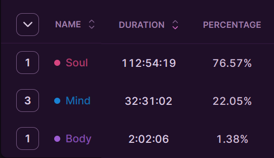

> "Aim for success" 

## Table of Contents

```toc
# This code block gets replaced with the TOC
```

### Focus of the month

Ok, this month I am going to try to come up with S.M.A.R.T goals. Now, it is not a new term in my vocabulary or something like that, but I was not thinking about applying to my knowledge portfolio investment until I have read a book Pragmatic thiking and Learning by Andy Hunt.

AS A. R. and T. are quite easy to know, I am going to focus only on S - specific and M - measurable

So, here are the goals

* Art - Write a research article about applying rigging to models which are usable inside of Unity
* Finances -  Have at least three selected invest funds to invest regulary
* Programming - Learn about at least 4 different algorithms, preferably from the Grooking algorithm book
* Mind well being - Meditate at least 20 days in March for at least 15 minutes
* Body well being - Do yoga at least for 20 days from Yoga with Adrien - 30 days challenge
* Languages - Learn Hiragana and Katana with 90% precision

I have a book about conducting a research, so I am thinking about reading that one too, but it is not mandatory. 


### Reflection

It seems that I completely forgot about the goals I set last time, as most of my time was spent playing games and not on learning.

However, I have found some positives in this situation. Firstly, I have divided my measured time into three categories: soul, body, and mind.



"Soul" is mostly about activities that make me feel good, such as playing games, watching movies, and meditation. "Body" focuses on physical activities, and "mind" is dedicated to supporting my knowledge portfolio.

I spent almost 148 hours on various activities, which averages to 4.9 hours per day. Gaming took up 71 hours alone, which is an average of 2.3 hours per day. This means that there is time available that I can dedicate to learning.

I was only spending one hour per day on learning, but I don't want to give up playing games entirely as I feel it helps me understand mechanics better, improves my thinking, and reduces my fear of failure. Therefore, I believe my goal should be to spend at least 2 hours on learning each day, with the rest of my time devoted to playing games.

Additionally, I need to allocate some time each day to focus on physical activities for my body, aiming for at least half an hour a day. I will see how this plan goes in practice.