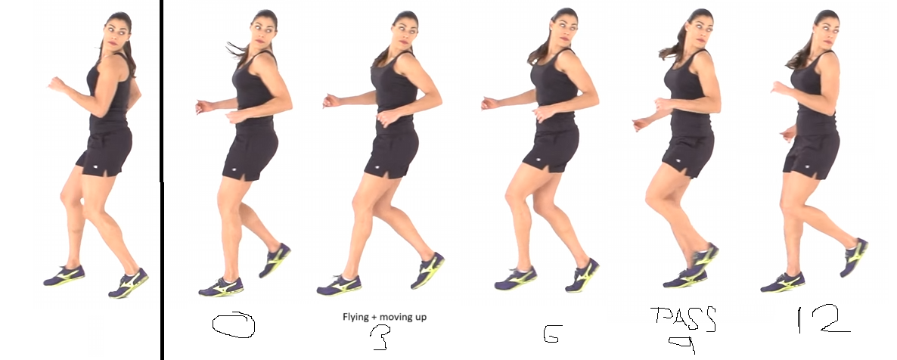

> "Why dont you listen a music while you work?" 
> "Are you crazy? I am not that clever to do more things at once!" 

## Table of Contents

```toc
# This code block gets replaced with the TOC
```

### Focus of the month

November is going to be all about the ["game jam"](https://itch.io/jam/game-off-2023).  I hope to put into practice some of the knowledge from the last few months, namely Blender and shaders. 

The goal is to spend at least 2 hours a day on average working on the game jam. I believe this should be achievable. I'm going to use tags to track the time spent on the game jam, allowing me to monitor how much time I dedicate to specific disciplines.

### Reflection

The whole month should had been dedicated to the game jam, but only a part was. I averaged 1.5 hours per day in the part dedicated to the game jam which is not bad at all. If I would not count weekeneds as they are usually spend with some other activities, it is 1.8h per day which is pretty close to the goal I set up. I think that with clear project in head it is easier to put the hours in. I was playing with the Unity after long time (which remind me to get the FSM working in the template), but also pushed the knowledge in Blender a bit futher.

The second part of the month was a bit more challenging. As I mentioned in previous blogs, I've started working with ASP.NET. Although I expected the transition to be manageable, it turned out to be quite difficult. My senior colleague is making it tough by not providing a clear perspective on their thought process. It feels like I'm trying something, and then waiting for the code review to tear it down. Additionally, he wrote sentences like "if you knew .NET a bit" or "if you were a programmer," which are quite harsh things to say to someone who is just starting with a new technology. 

On the other hand I have to say I understand his approach, it is a trial by fire and I believe it is going to be quite effective. It pushed me to prove myself as I have proven myself in the past by learning quickly. I hope that, at the very least, there will be some benefit to my current hobby (game development) in all of this. This means I had to invest some hours into ASP.NET. Firstly, we are working on something called domain-driven services (microservices), so I had to start learning what domain-driven development is. Then, I spent some time getting familiar with the things I had to use at work like dependency injection and configurations.

Another important thing I noticed is my lack of focus. I am doing way too many mistakes at work by not focusing on what I am doing. There is nothing more write about it, as it is going to be a topic for a next month.

#### Blender

The main goal was to create a character from model to animation. I was doing a lot of research and practice before after my failure at Ludumdare 54. It still was quite challenge, but not something I could not handle. Biggest challenge was to align cloth with the rest of the body for animation. But thanks to this the connection between loops and animation just clicked. By creating good loops, you are able to assign proper vertices to the vertex groups, which then gives you the ability to create proper weights for bones, resulting in a much easier animation creation. 

As for the animations, first thing was to create a Unity ready armature. I have had a help from this tutorials. But the key takeaways is to create game ready rig and control rig, while the game ready rig is copying transformation from control rig. As soon as the animation using control rigs are done, you then bake the animations to the game rig and these baked animations are then imported to the Unity. The whole workflow can be simplifed with Blender Rigify, which I am about to learn some day.

And where to get an idea how to create proper running, walking or jumping animations? Well, I found a video of people doing this activities and I screenshot them in various position and then recreated in Blender. To give you and idea which position you should select, use a book ["Animator's survival kit"](https://www.amazon.com/Animators-Survival-Kit-Richard-Williams/dp/0571202284) where authors explains the basics.

 


#### Unity

It is going to big suprise, but the main goal for Unity was well, to create a game for GameOff gamejam. I managed put some basic ground for the game. It was a dodge ball game with zen master in zen garden. But I did not finished thanks to the new stress in the work. I played a lot with the FSM, at first I created FMS for the ball itself and then reworks the player script to FSM also, because I wanted to use the same components for enemies and separating the states of player also helps to align them with animations from Blender. It made sense, but the cost was too high for LudumDare, it did not bring anything to the table which I needed right away. Anyway, I have to finish the FSM in the template and write a little guide for it, so I can use it next time without working on the whole stuff again.

Also, I keep thinking, what is the AI they use in fighting games? Is it FSM? Goat? ML? I have to study that I bit as fighting game is going to be what I will create in the end.

#### Work related stuff

Even though I am learning this mainly for work and to ask for raise next year I have to say that the domain driven design is interesting. Cant say that working closely with domain experts is something new to me as I was trying to push same approach at my first work, where I was trying to persuade managers to select one worker from each department who is going to be called "process expert" and we, as IT, are going to work directly with him, because we will be able to build a common ground and work more effectively. Of course, DDD is more advance, it also introduce framework how to put this commong ground to the code. 

Another stuffs which I learned in ASP.net were focused on what I did not understand properly during the development. For example dependency injection, I know what it is and how to use it, but I wanted to dig a little bit deeper, so I learned a lot of stuff around and it makes me feel more comfortable to work with it.

I think that during learning ASP.net I realized that everything is about asking right questions. What do we do things the way we do? What is this? What does this do? All the time. "Why do I brush the teeth the way I do?" This inner dialogue brings a lot of clarity, but of course, it is heavy brain overload at times.