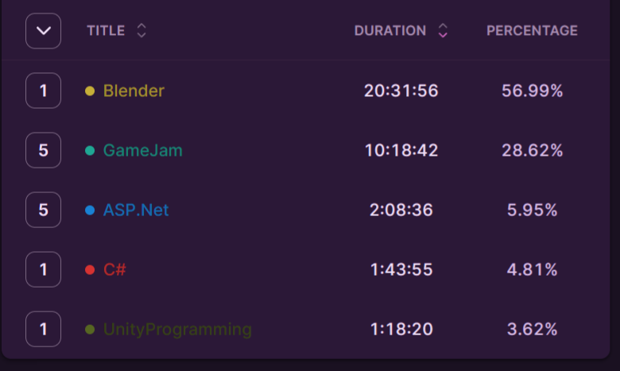

> "Every second counts" is a phrase from The Bear that was supposed to evoke a certain feeling in me, but it didn't. I'm already well aware that every second counts. I just couldn't think of anything better to include in this part. :)

## Table of Contents

```toc
# This code block gets replaced with the TOC
```

### Focus of the month

October is going to be more focused on work-related knowledge because I feel it's necessary at this point. I had considered finishing the game jam for the "extra" category, but the thought of combining it with what I need to learn for work was overwhelming, and it's not something I want to tackle right now. I'm working on building routines that will help me reach an average of 3 hours of learning per day, and I think adding the game jam would slow me down.

Here's the plan: I'll continue working with Blender, but this time I'll focus more on character creation, from modeling to animation. This area gave me some trouble during the Ludumdare, so I want to improve my skills here. For my work, I need to advance in ASP.NET, deepen my understanding of domain-driven development, and learn more about its patterns.

Additionally, during LudumDare, I used Trello, and I found it helpful for staying on track. So, I plan to use it for month-to-month planning of the knowledge I need to acquire. We'll see where it takes me.

### Reflection

#### Time spent

This month, we have allocated our time over 30 calendar days. However, on the last day of the month, I won't be able to dedicate any time as I need to catch up on work hours.

 

As you can see, I have reached 36 hours of **personal** time for studying, which brings me to an average of 1.2 hours per day. Not good, but not bad either. I made 'personal' bold because I spent another 30 hours learning ASP.NET and domain-driven service architecture at work, and therefore, I had no energy left for learning after work.

#### Trello

I was playing with the idea of keeping a day-to-day to-do list in Trello. However, most of the tasks were repeating themselves as 'Work on Blender,' 'Work on Blender,' 'Work on Blender,' which was tiring. Therefore, I decided to give up on it.

But! I was also trying to structure it into 'Explore,' 'Research,' 'Practice.'

**Explore** should be limited to reading, watching, or listening to new information, without going too deep. The goal is to determine whether it's something that piques my interest or might be useful. In the past, when I consumed tutorials at double speed, I realized that I didn't always need to understand everything; I just needed to know what resources were available. It's like knowing what tools are in the toolbox and their purposes without necessarily knowing how to use them.

**Research** involves going in-depth. I aim to incorporate Richard Feynman's approach to learning during my research. This month, I dedicated some time to studying the SOLID principles. I plan to write a blog post about it as soon as I determine the structure I will use for writing the research blog post.

**Practise**, as the name implies, is about practicing on a real project. I had originally planned to work on an ASP.NET CORE API this month, but due to work commitments, I ended up focusing solely on practicing Blender.

I plan to maintain this structure in December, and I will also attempt to tag the time spent with labels such as "explore," "research," and "practice" to better track how much time I allocate to each category.