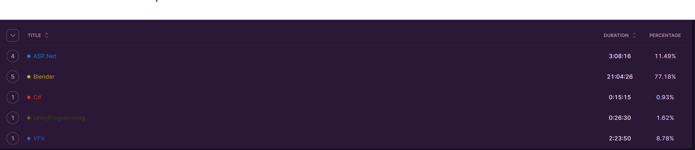
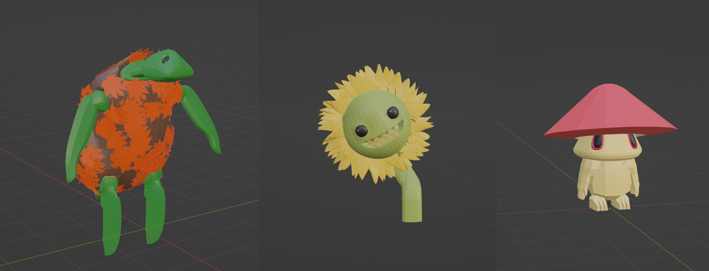

## Table of Contents

```toc
# This code block gets replaced with the TOC
```

### Focus of the month

This is a list of skills I was thinking of for this month:

* Math
* Drawing
* Post-processing
* VFX graph
* Blender
* ASP.Net
* C#

But as you saw in last report, I am not able to manage that many skills in one month therefore I decided I will have to choose just three. 

First of all, it's necessary to say that ASP.Net is here solely for work, as it should be the technology in which I'm going to work next. I wasn't convinced I should spend my free time working on something I need for work but not for personal gain. However, I think that until I open my first game studio, I have to learn skills that also bring in money. With that being said, I'm going to refresh my memory on the ASP.Net theme, and after that, I'll move on to C#.

For my personal gain I think I am going to continue with GetGood for Blender. I wanted to take another step in shader graphs by learning from Ben, where he used them for post-processing. However, my formal computer is going through the warranty process, and the old one is not able to run the newest version of Unity, which holds the new features needed for this. So, I decided it is time to move on to the ["VFX graph"](https://unity.com/visual-effect-graph) as knowing this skill will allow me to later blend it with knowledge from the shader graph and create some cool effects.

I hope that this month I will be able to get close to the 3-hour average per calendar day.

### Reflection

I'm going to reflect on the time spent and then write a bit about my journey with Blender, as it's the only skill I've been learning that's worth describing.

#### Time spent
 

I spent 1.2 hours per calendar day from September 1st, 2023, to September 22nd, 2023. Well, that is far from my goal of averaging 3 hours per calendar day. It's even further from the goal I had last month, where I was averaging around 2 hours a day.

As you can see, I primarily focused on Blender, which was in line with my original plan. However, I didn't continue with GetGood, as you will read further on, but instead spent time trying to model things on my own. I also had plans to learn VFX Graph, which I did at the beginning, but soon realized that I needed a real project to fully focus on it. I learned the basics and read a book about VFX directly from Unity, and it's not that difficult, but there are many possibilitie which needs be learned by battles.

I also devoted some time to learning ASP.Net, which I foresaw as a necessity to keep a roof over my head until I open my first game studio in Pardubice. I had to learn a bit about xUnit and fluent validator in order to finish my "onboarding" project at work. Boy it was fun to do something new during my 9to5 time. :)

#### Blender

The Ludumdare gamejam is approaching, so I've made the decision not to spend the entire month on GetGood tutorials (although I did for a week). Instead, I'll focus on honing my existing skills to reduce the time needed for character creation, ensuring I can meet Ludumdare's deadlines.

Initially, I attempted to recreate a low-poly character and utilize Mixamo. The primary objective was to identify the issue causing Mixamo to not rig my characters properly. I discovered that careful overlapping of all character parts is crucial; otherwise, it won't function correctly. I then consulted my knowledgeable partner for suggestions on what she'd like to see me create. She consistently provided ideas that I prompt to the Midjourney app to get a idea for a model I then created in Blender. In total, I completed three rounds of this process, resulting in a mushroom, sunflower, and turtle. I handled the rigging myself and added a small animation for each. It was worth to refrain from "GetGood" tutorials as I become more confident with Blender thanks to this process.

 

For the last week of September I am going to prepare for Ludumdare, therefore I need to learn to create a humanoid fast. I saw a video about a guy who is able to make hunders of characters fast so I will watch it again and create similiar framework for myself.

#### Boring game

I spent quite a lot of time watching YouTubers who were participating in various game jams or pass-the-game challenges, and one thought came to my mind. They were all comfortable with one type of game and tried to adjust the theme to it. It made me realize that this is a good approach for game jams because you will have a solid foundation upon which you can build. Therefore, I spent a few hours thinking about what my theme would be, and I ended up with "fighting arena" games. As sad as it is, it means I am not going to finish the Boring Game I (even though the main reason for the boring game was to finish something). Instead, I am going to focus on building fighting arena games. I'm going to call it Boring Game II.
