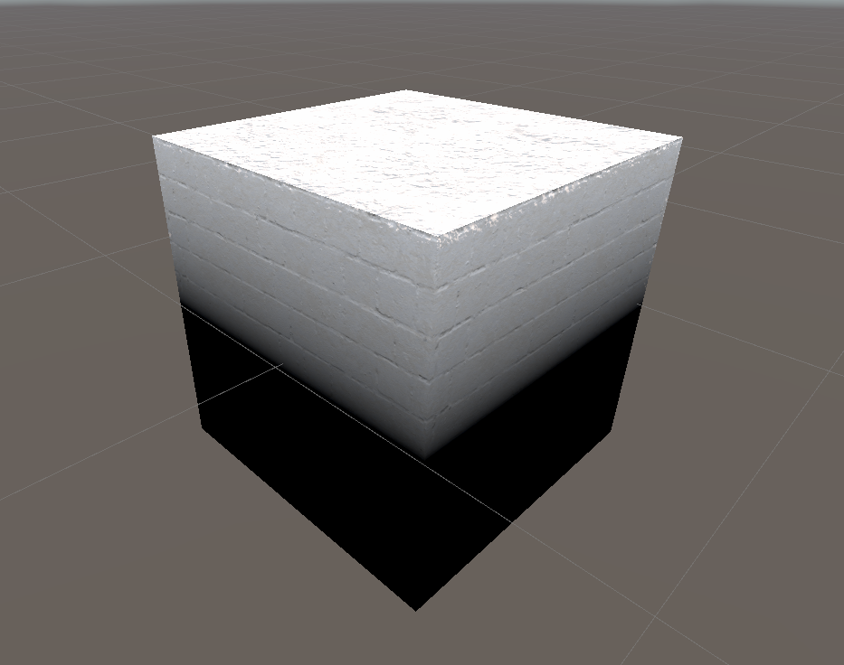

This post will guide you through my journey of learning shaders in Unity. My ultimate objective is to create an environment reminiscent of the one found in 'Master of Anima.', beucase I would like to recreate some of its mechanics which I intend to infuse them with a unique interpretation.

## Table of Contents

```toc
# This code block gets replaced with the TOC
```

### Ben Cloward - Shader graph basics

Right from the start, I dived into Gabriel's courses, eager to roll up my sleeves and get into the thick of it. And okay, it seemed pretty straightforward initially, but soon enough, I realized there were gaps in what I knew. I had a rough idea of how things worked, you know? I even whipped up a test shader to put my theories to the test, but I still craved that clear explanation in black and white. So here's the deal: I'm giving a thumbs-up to kick off with this [course](https://www.youtube.com/watch?v=OX_6_bKpP9g&list=PL78XDi0TS4lEBWa2Hpzg2SRC5njCcKydl&pp=iAQB "course") - it's like building your base, giving you solid ground to take on shader graphs with confidence.

Personally, while embracing the journey throught this course, I've taken on the '50/50' principle, drawing inspiration from [draw a box](https://www.drawabox.com "drawabox") a balance of 50% focused study intertwined with 50% immersive hands-on practice with courses from Gabriel Aguiar.


### Gabriel Aguiar - Unity Shader graph tutorial

During this course, or better to say list of "how tos" for specific type of shaders, I applied what I have leared in Ben Cloward course.  

#### Hands-on practise
##### Moss
* [Moss](https://youtu.be/Q43XBychCEY)
  * can be combined with with [view, world, object & tangent](https://youtu.be/E6Srr-HaicI) which will allow you to honor the shape of the object given by normals
  * the moss course also introduced blending normal maps, which is done lerping the textures, but there is an [another approach](https://youtu.be/GKVBJ7aO1Mk) to it
  * there were two more videos on how to improve normal maps, but they required having textures prepared in a specific manner. I chose to skip it as I did not want to spend time by preparing the textures for it.


As a testament to my skills, I attempted to apply moss to the cube. However, the same method only worked on one side (the top), which wasn't the desired outcome. I realized I needed a gradient from bottom to the top of the cube. Nevertheless, I was uncertain about the approach until I came across the [lenght & distance](https://youtu.be/wTHKzjYBH7U) tutorial, which demonstrated how to move the pivot of the UVs which did the trick.

While I was attempting to merge this knowledge with insights from [view, world, object & tangent](https://youtu.be/E6Srr-HaicI) to properly honor the shape bestowed by normals on the object, a realization dawned that I lacked clarity about the behavior of vectors during their transformation from tangent space to another space. And let me tell you, it took an unexpected turn from there. I scoured the internet, embarking on a journey that carried me from elementary tutorials to the comprehensive courses on [math planet](https://www.mathplanet.com/) and the captivating streams by [Freya Holmér](https://www.youtube.com/@Acegikmo). Both captivated my attention. It seems the time has come to tread the path of "To learn MATH" on my journey. 




### Handy links

* [This](https://polyhaven.com/) is a great link for downloading PBR materials or models
* [Solution](https://forum.unity.com/threads/main-preview-in-shader-graph-is-blank.1412793/ "solution") to problem with previewing shaders in the shader graph for opaque materials
* [Official manual](https://docs.unity3d.com/Packages/com.unity.shadergraph@5.6/manual/Getting-Started.html "shader graphs manual")

